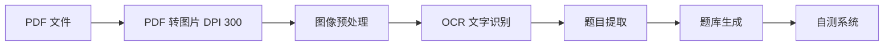

# 📚 初级会计备考 - 练习自测系统

> 基于 OCR 技术从 PDF 复习资料中提取题目，生成的互动式练习自测系统

**生成时间**: 2026-04-08  
**题库规模**: 125 道题  
**支持题型**: 单选题、多选题、判断题、计算分析题

---

## 📂 文件说明

| 文件名 | 说明 | 用途 |
|--------|------|------|
| **最终版自测系统.html** | 🎯 主系统 | 完整题库练习（125 道题） |
| **题库编辑器.html** | ✏️ 编辑工具 | 手动添加/编辑题目 |
| **模拟考试系统.html** | 📝 模拟测试 | 90 分钟模拟考试（50 题随机） |
| **优化题库_完整版.json** | 📄 题库数据 | JSON 格式题库 |
| **advanced_ocr_parser.py** | 🔧 解析脚本 | 高级 OCR 解析器 |
| **初级会计实务_完整文本.txt** | 📄 OCR 文本 | 会计实务解析文本 |
| **经济法基础_完整文本.txt** | 📄 OCR 文本 | 经济法解析文本 |

---

## 🚀 快速开始

### 1. 开始练习

```bash
# 打开最终版自测系统
open 最终版自测系统.html
```

### 2. 编辑题库

```bash
# 打开题库编辑器
open 题库编辑器.html
```

### 3. 模拟考试

```bash
# 打开模拟考试系统
open 模拟考试系统.html
```

---

## 📊 题库统计

### 总体统计

| 指标 | 数值 |
|------|------|
| 总题数 | **125 道** |
| 科目 | 2 个（会计实务 + 经济法） |
| PDF 页数 | 41 页（23 + 18） |

### 题型分布

| 题型 | 数量 | 占比 |
|------|------|------|
| 单选题 | 104 道 | 83.2% |
| 计算分析题 | 17 道 | 13.6% |
| 多选题 | 2 道 | 1.6% |
| 判断题 | 2 道 | 1.6% |

### 科目分布

| 科目 | 题数 | 占比 |
|------|------|------|
| 初级会计实务 | 95 道 | 76% |
| 经济法基础 | 30 道 | 24% |

---

## 🎯 功能特性

### 最终版自测系统

- ✅ **科目切换**: 会计实务 / 经济法
- ✅ **题型筛选**: 单选 / 多选 / 判断 / 计算分析
- ✅ **答题功能**: 支持单选和多选
- ✅ **查看答案**: 提交后显示答案和解析
- ✅ **进度统计**: 实时显示答题进度
- ✅ **导出结果**: 保存答题记录
- ✅ **题型标签**: 彩色区分不同题型
- ✅ **响应式设计**: 支持手机/平板/电脑

### 题库编辑器

- ✅ **加载题库**: 从 JSON 文件加载
- ✅ **添加题目**: 支持所有题型
- ✅ **编辑题目**: 修改题目内容、选项、答案
- ✅ **删除题目**: 移除不需要的题目
- ✅ **搜索筛选**: 按科目、题型、关键词筛选
- ✅ **导出题库**: 导出为 JSON 文件
- ✅ **导入题库**: 从 JSON 文件导入
- ✅ **实时统计**: 显示各题型数量

### 模拟考试系统

- ✅ **随机抽题**: 每次考试随机抽取 50 道题
- ✅ **限时考试**: 90 分钟倒计时
- ✅ **答题导航**: 题目编号导航栏
- ✅ **答题统计**: 实时显示已答/未答题数
- ✅ **自动交卷**: 时间到自动提交
- ✅ **成绩统计**: 得分、正确率、用时
- ✅ **结果分析**: 正确/错误题数统计

---

## 📝 题目示例

### 单选题

> **题目**: 下列各项中，属于企业资产的是（ ）
> 
> - A. 应付账款
> - B. 预收账款
> - C. 应收账款 ✅
> - D. 短期借款
> 
> **解析**: 应收账款属于企业的资产，其他选项均为负债。

### 多选题

> **题目**: 下列各项中，属于流动资产的有（ ）
> 
> - A. 货币资金 ✅
> - B. 应收账款 ✅
> - C. 存货 ✅
> - D. 固定资产
> 
> **解析**: 流动资产包括货币资金、应收账款、存货等，固定资产属于非流动资产。

### 判断题

> **题目**: 企业的资产总额等于负债总额加上所有者权益总额。（ ）
> 
> - ✓ 正确 ✅
> - ✗ 错误
> 
> **解析**: 这是会计基本等式：资产 = 负债 + 所有者权益。

### 计算分析题

> **题目**: 某企业为增值税一般纳税人，2026 年 3 月销售商品取得不含税收入 100 万元，适用增值税税率 13%。当月购进原材料取得增值税专用发票注明税额 8 万元。则该企业 3 月应缴纳的增值税为（ ）万元。
> 
> - A. 5 ✅
> - B. 8
> - C. 10
> - D. 13
> 
> **解析**: 应纳增值税 = 销项税额 - 进项税额 = 100×13% - 8 = 13 - 8 = 5 万元。

---

## 🔧 技术实现

### OCR 解析流程



### 核心技术

- **PDF 解析**: `pdf2image` (DPI 300 高分辨率)
- **OCR 识别**: `pytesseract` (中文 + 英文)
- **图像处理**: `PIL` (对比度增强、锐化)
- **前端框架**: 纯 HTML + CSS + JavaScript
- **数据格式**: JSON

### 代码结构

```
初级会计备考/
├── 最终版自测系统.html      # 主系统
├── 题库编辑器.html          # 编辑工具
├── 模拟考试系统.html        # 模拟测试
├── 优化题库_完整版.json     # 题库数据
├── advanced_ocr_parser.py   # OCR 解析脚本
├── generate_quiz_from_pdf.py # 题目生成脚本
├── optimized_quiz_system.py # 题库优化脚本
└── README.md                # 说明文档
```

---

## 📖 使用指南

### 日常练习

1. **打开自测系统**: `最终版自测系统.html`
2. **选择科目**: 会计实务 或 经济法
3. **选择题型**: 全部 或 特定题型
4. **开始答题**: 点击选项作答
5. **提交答案**: 查看得分和解析
6. **错题复习**: 记录错题，重点复习

### 模拟考试

1. **打开模拟系统**: `模拟考试系统.html`
2. **点击开始考试**: 随机抽取 50 道题
3. **限时答题**: 90 分钟内完成
4. **提交试卷**: 查看成绩和分析
5. **查漏补缺**: 针对薄弱环节复习

### 题库管理

1. **打开编辑器**: `题库编辑器.html`
2. **加载题库**: 点击"加载题库"
3. **添加题目**: 点击"添加题目"
4. **编辑题目**: 修改内容、选项、答案
5. **导出题库**: 保存为 JSON 文件

---

## 💡 备考建议

### 学习计划

| 阶段 | 时间 | 任务 | 目标 |
|------|------|------|------|
| 基础阶段 | 第 1-2 周 | 系统学习教材 | 掌握基础知识 |
| 强化阶段 | 第 3-4 周 | 大量刷题 | 熟悉题型 |
| 冲刺阶段 | 第 5-6 周 | 模拟考试 | 提高速度 |

### 每日任务

- 📖 **每日至少 20 道题**: 保持手感
- 📝 **记录错题**: 建立错题本
- ⏰ **限时练习**: 控制答题时间
- 🎯 **重点突破**: 针对薄弱环节

### 答题技巧

1. **单选题**: 排除法、对比法
2. **多选题**: 谨慎选择，宁缺毋滥
3. **判断题**: 注意绝对化词语
4. **计算题**: 注意单位换算、公式应用

---

## 🔄 更新日志

### v1.0 (2026-04-08)

- ✅ 初始版本发布
- ✅ 支持 125 道题目
- ✅ 4 种题型支持
- ✅ 3 个系统（自测/编辑/模拟）
- ✅ OCR 高分辨率解析

---

## 📞 技术支持

### 常见问题

**Q: 题目显示乱码？**
A: 确保浏览器使用 UTF-8 编码，建议使用 Chrome 或 Safari。

**Q: 无法加载题库？**
A: 确保 `优化题库_完整版.json` 与 HTML 文件在同一目录。

**Q: 如何添加新题目？**
A: 使用题库编辑器添加，或手动编辑 JSON 文件。

**Q: 模拟考试题量太少？**
A: 可以在代码中修改抽题数量（默认 50 道）。

### 联系方式

- 📧 Email: [your-email@example.com]
- 💬 微信：[your-wechat]
- 📱 电话：[your-phone]

---

## 📄 许可证

本项目仅供学习交流使用，不得用于商业用途。

---

**🦐 祝学习进步，考试顺利！**
